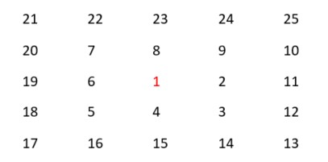
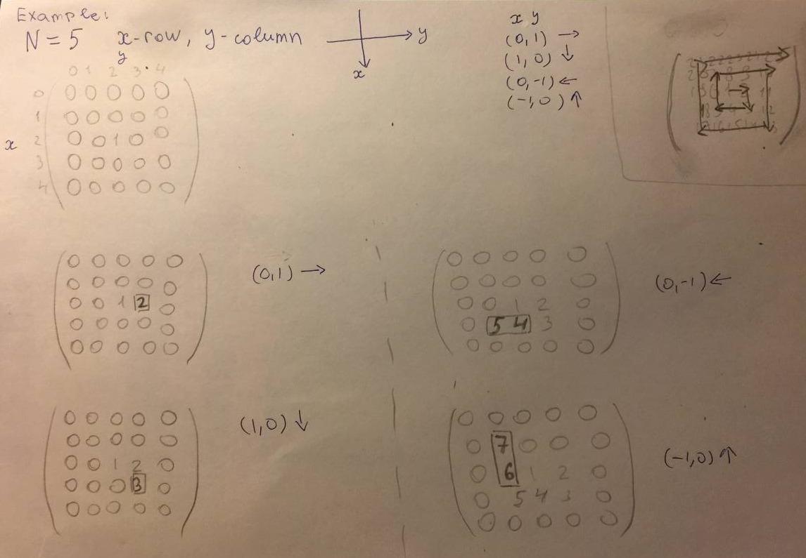

# Section 2


>## Part1: 

#### _The program finds the center of the square matrix and, moving clockwise, increases the number sequentially._

- the center of the matrix starts from 1.
- input: size of the square matrix (NxN).
- output: A NxN matrix filled with numbers starting from 1 at the center and moving outward in a clockwise manner increasing sequentially, filling the matrix completely.

Example:

For N = 5, the output should look like:

<p align="center">
  
</p>

### Algorithm

Starting to fill in the matrix manually, we can notice a certain algorithm :

first, let's decide on the direction  : 

by convention, the numbers should increase clockwise 

1 - to the right

2 - down

3- to the left

4- up 

and so it goes on cyclically until our number is equal to the square of the size.


We can also notice that every two steps the step size also increases by one and after each step the direction changes, as shown below in the photo:

fill in the matrix with zeros for convenience

<p align="center">
  
</p>

The algorithm is that :

after each step, the direction changes cyclically and every two steps the step size increases by one until the number is equal to the size of the matrix squared.

### Explanation of the code

The function takes the size of the matrix, then a matrix filled with zeros is created (you can fill it with anything you want).

The center of the matrix is located and by condition the value in the center should start with 1. 

To control and change the direction, a list of tuples is created.

The initial step is 1.

````py
def my_matrix(n):
    matrix = [[0] * n for _ in range(n)]

    x = (n - 1) // 2
    y = (n - 1) // 2
    num = 1

    direct = [(0, 1), (1, 0), (0, -1), (-1, 0)]
    indexOfDirect = 0

    step = 1
    i = 0
````

>Next, we run the cycles.

Let's start with the innermost cycle:

In this cycle, we are already starting to assign the value we need to the elements of the matrix, but first we check whether the indexes do not go beyond the range of the matrix size.

Using our algorithm, we must give the direction, in our list the direction is already in the correct sequence, so the index will start from zero "direction = direct[indexOfDirect]" where before that we had already initialized the variable "indexOfDirect = 0".

Then we pass the increments to the new variables, which should be added to our indexes in order to change the direction.

````py
for j in range(step):
    if (0 <= x and x < n) and (0 <= y and y < n):
        matrix[x][y] = num
        num = num + 1
    
    direction = direct[indexOfDirect]

    x_direct = direction[0]
    y_direct = direction[1]

    x = x + x_direct
    y = y + y_direct
````
Here a cycle with a counter is started and it goes through the inner cycle twice, since after every two passes we change the step length by 1

````py
while 1:
    for j in range(step):
        if (0 <= x and x < n) and (0 <= y and y < n):
            matrix[x][y] = num
            num = num + 1
        
        direction = direct[indexOfDirect]
    
        x_direct = direction[0]
        y_direct = direction[1]
    
        x = x + x_direct
        y = y + y_direct

    if indexOfDirect == 3:
        indexOfDirect = 0
    else:     
        indexOfDirect += 1

    i = i + 1

    if i == 2:
        i = 0
        break
````

As mentioned earlier, after each two passes, the length of the step "step + = 1" will change.

As well as checking whether we have accidentally filled in the entire matrix already "while num <= n ** 2"


````py
    while num <= n ** 2:
        while 1:
            for j in range(step):
                if (0 <= x and x < n) and (0 <= y and y < n):
                    matrix[x][y] = num
                    num = num + 1

                direction = direct[indexOfDirect]

                x_direct = direction[0]
                y_direct = direction[1]

                x = x + x_direct
                y = y + y_direct

            if indexOfDirect == 3:
                indexOfDirect = 0
            else:
                indexOfDirect += 1

            i = i + 1

            if i == 2:
                i = 0
                break

        step += 1

    return matrix
````
After the function returns the matrix to us, we output it indented (for a better and clearer view).

````py
n = int(input("Size of the square matrix: "))
while n < 0:
    print('must be non-negative')
    n = int(input())

matrix = my_matrix(n)
for row in matrix:
    print(' '.join(f'{num:2}' for num in row))
````

that is, our matrix is ready!

>## Part2: 

Here we add up the diagonals of the matrix.

Function:

```py
def sumOfDiagonals(matrix):
    primarySum = 0
    secondarySum = 0

    for i in range(n):
        primarySum += matrix[i][i]
        secondarySum += matrix[i][n - i - 1]

    return primarySum, secondarySum
````
In this function, we sum up separately all the values in our matrix that are on the main and secondary diagonals.

Output:

````py
diagonal_sums = sumOfDiagonals(matrix)

print(f"Primeay diagonal sum: {diagonal_sums[0]}")
print(f"Secondary diagonal sum : {diagonal_sums[1]}")
````
## Conclusion

_This project demonstrates an algorithm for filling the matrix by moving clockwise, followed by calculating the sums of the diagonals._


